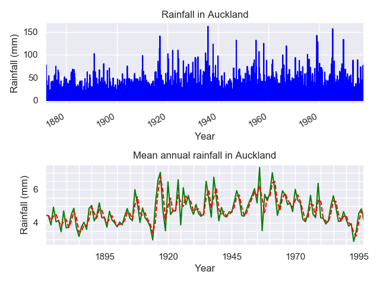
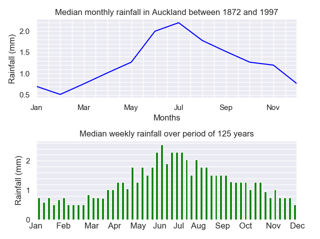

# Time_series_analysis
Repository for data analysis and visualization of time series data

## Time series analysis of rainfall data in Auckland

I am exploring here rainfall data in Auckland between 1872 and 2011, using a set of tables published on the Auckland Council website: https://environmentauckland.org.nz/Data/DataSet/Summary/Location/A64871M/DataSet/Rainfall/Continuous/Interval/Latest. 
Five tables (in /Data/ folder) contain the amount of rain in millimetres, measured at two different locations: Mt Albert and City centre. The tables cover various time intervals starting from 6 years to 140 years, and they include both measured values and synthesized data.
Using a Python script, we displayed annual and weekly rainfall data and explored the main statistics for table A64871M, covering a period between 1872 and 1997.  The table contains five columns and 31652 rows, but only two columns are needed for our analysis:  dates and the amount of rain in millimetres. The dates are given for NZST (UTC +12h) time zone. The frequency of the measurements is between 1 and 10 days. 

After importing data from the AucklandRainfall1872-1997.csv table, the software removes unnecessary columns and headers and then prints some exploratory data analysis and displays two graphs. The first plot shows the entire set of measurements and the mean annual rainfall variations from one year to another. The second graph represents seasonal changes in the amount of rain accumulated during one year as a median of data grouped for each month over the entire period of 125 years.  From the second graph, we can notice that the months with the most rain in Auckland are June and July and that the amount of rain increases gradually from February with the minimum rainfall recorded during summertime. The maximum amount of rainfall of 165 mm was collected on February 2nd, 1936, while the days with measurements zero are considered as days without rain.  

This is one way of presenting and analysing time-series data. We can also include data from other tables and use Jupyter Notebook and Python Bokeh library for more interactive visualization.

##### Figures

### Basic Statistics:

Number of rows: 31652

Start date: 1872-01-03 00:00:00 --- End date: 1997-09-30 08:30:00

Number of measurements: 31652

Number of unique dates: 31652

Number of days bewteen the first and the last measurements: 45926

Number of days with no measurements: 14274

Number of days with no rain: 8473 --- 27%

Number of days with rainfall of less than 1mm/day: 18246 --- 58%

Dates with the maximum rainfalls:

timestamp           rain_value(mm)

1936-02-02            162.05

1985-05-23            156.60

1979-02-18            142.20

1917-02-04            140.72

1989-08-26            133.30

