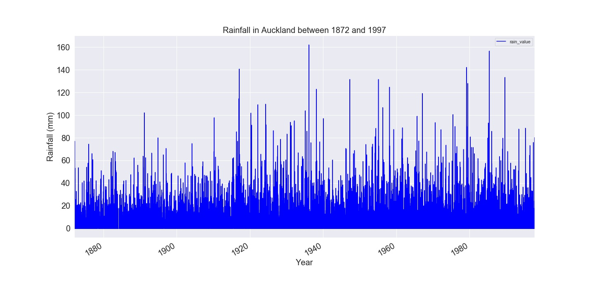

# Time_series_analysis
Repository for data analysis and visualization of time series data

Time series data are everywhere from weather forecasting, signal processing, and heart rate monitoring to stock market analysis, sales forecasting, and variable stars studying. Time series data represent any sequence of values collected at discrete, regular or irregular, time intervals.

#### 1. Time series analysis of Auckland rainfall data

This repository contains Python scripts and notebooks for analysis of Auckland rainfall time series data. Why have I decided to use an Auckland Council file covering a period of 125 years between 1872 and 1997? The A64871M provides a unique opportunity for studying a time-series that cover an extended period and therefore creates many challenges. Firstly, measured data are of different qualities with the weights that need to be explored and included in the input table.  We also have problems with missing data, atypical values, and outliers, as well as with fitting models that provide information about data statistics, trends, and seasonal changes.  

#### 2. Variable stars light curves
